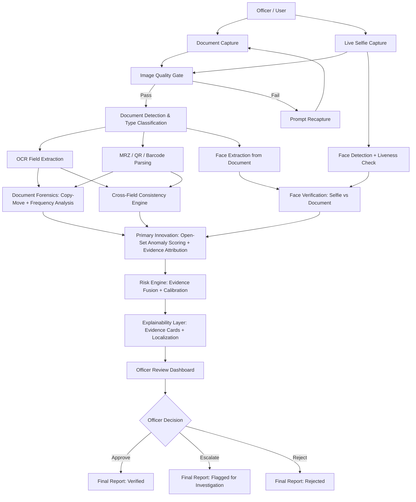
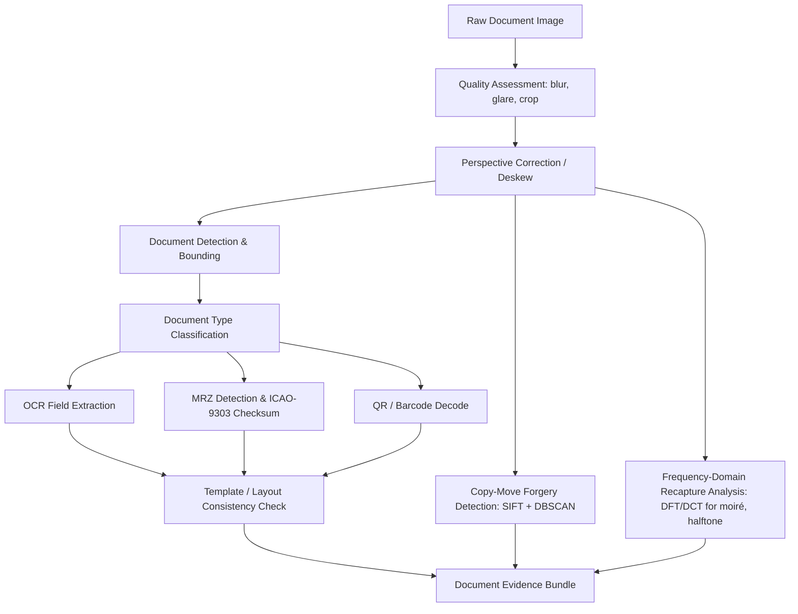
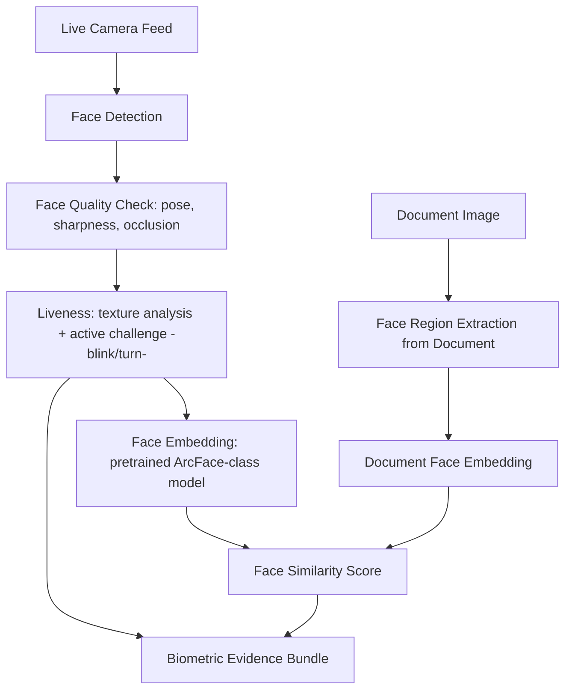
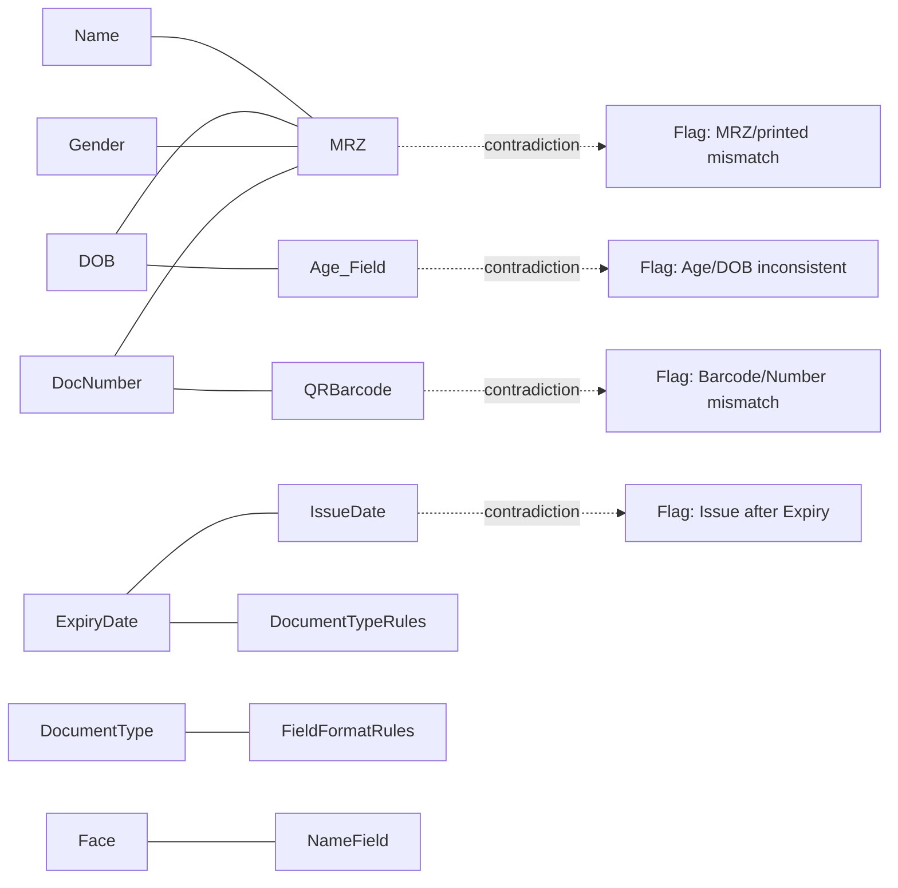
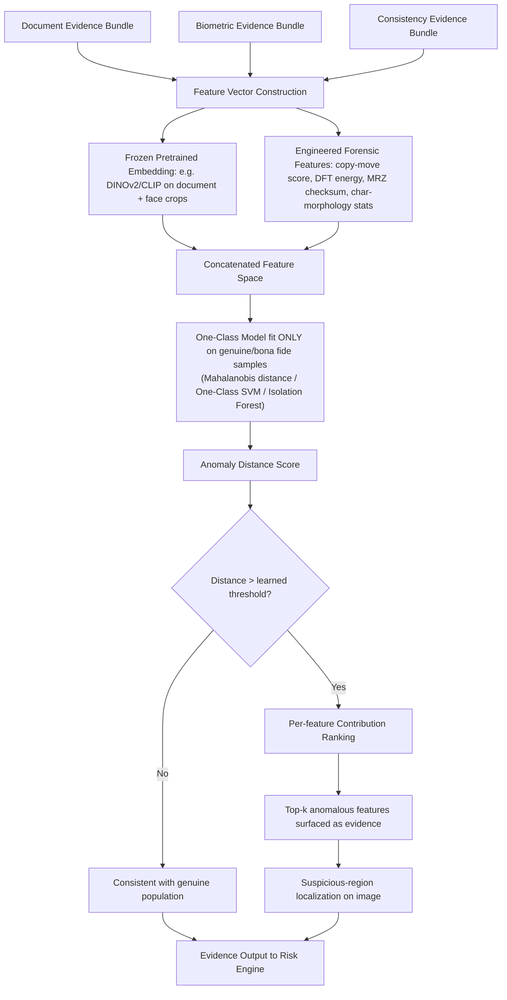
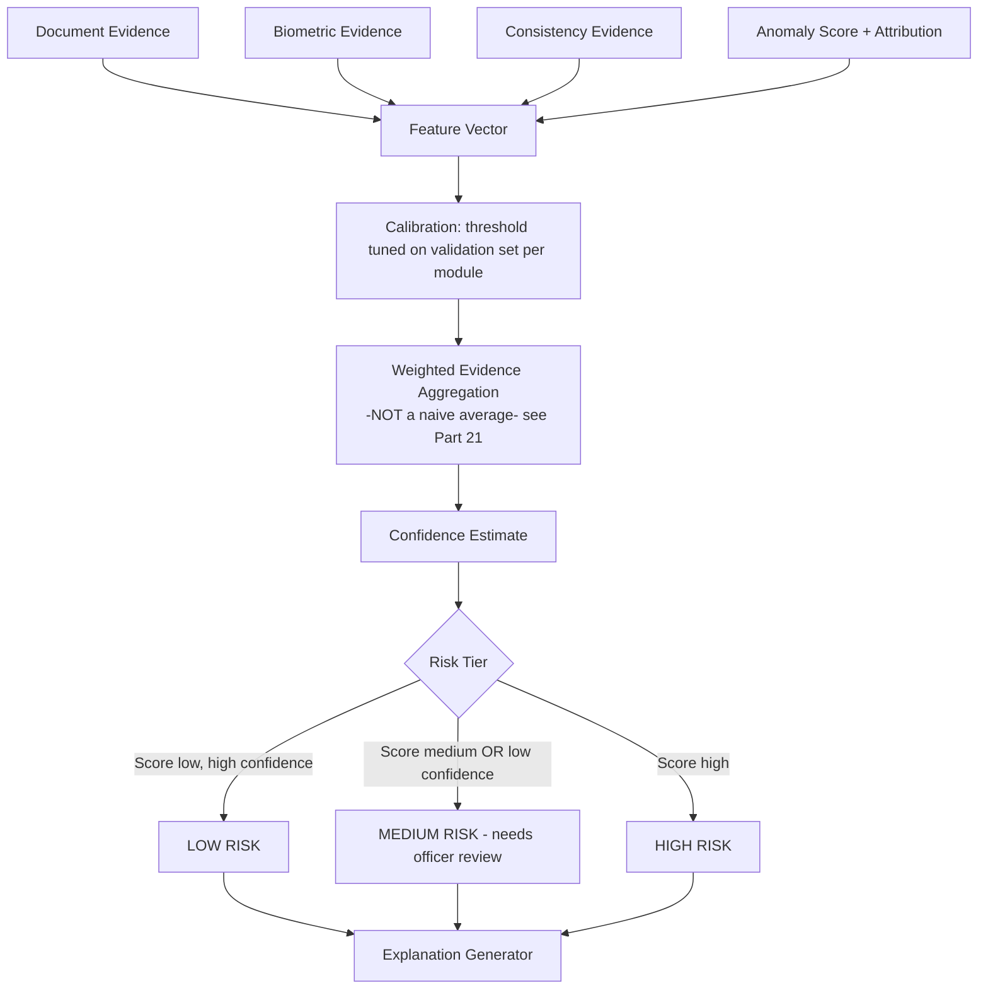
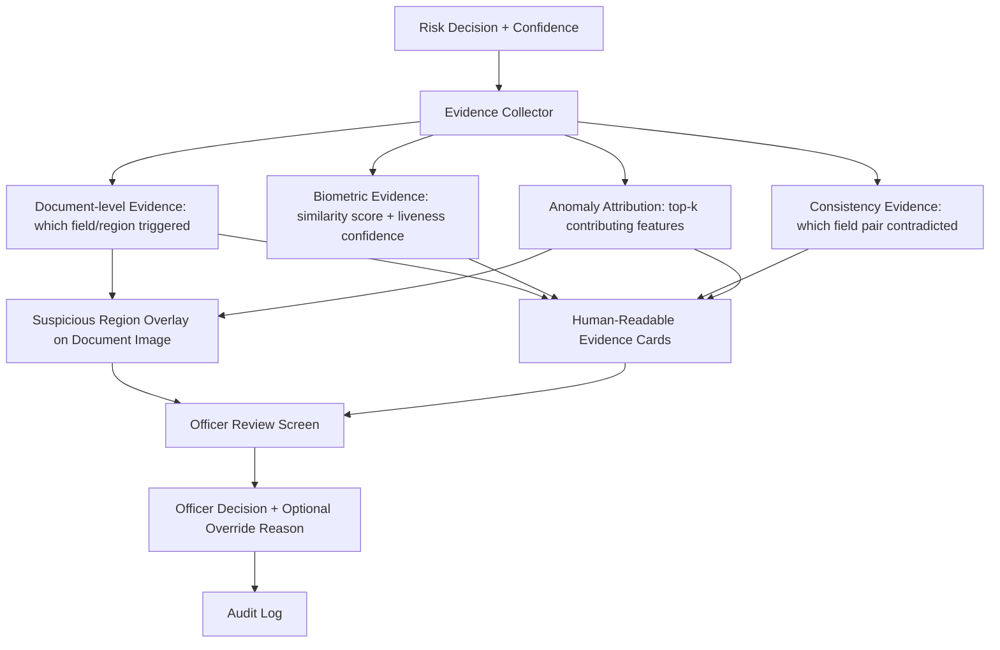
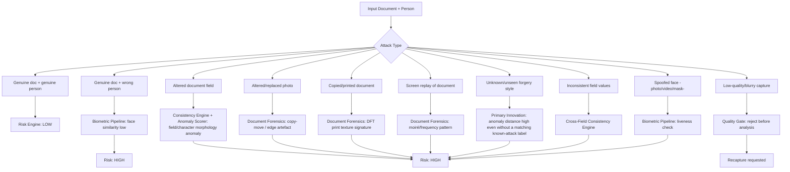

# TrustLens — AI-Based Fake Identity & Document Screening System
### Master Architecture & Product Strategy — SIH26188
*Prepared for a 6-member, 2nd-year engineering team · 2–4 day build window*

---

## HOW TO READ THIS DOCUMENT

Every claim below is tagged so you always know what's verified fact vs. our design judgment:

- **[SIH-CONFIRMED]** — verified against the official SIH 2026 catalogue via live search on 27 Aug 2026.
- **[SIH-INFERRED]** — reasonable assumption based on standard SIH format + domain context. **Not official text — verify on sih.gov.in before finalizing your PPT.**
- **[PAPER-n]** — drawn from one of your 5 uploaded papers (numbered below).
- **[WEB]** — drawn from live web search of the current commercial/competitive landscape.
- **[OUR DESIGN]** — our own architectural decision, not sourced from any document.

**Your uploaded evidence base:**

| # | Paper | What it actually contributes |
|---|---|---|
| P1 | Zhang et al., *AI-Based Identity Fraud Detection: A Systematic Review* (UTS, 2025, 43 papers) | Taxonomy of the whole field: biometric recognition + visual anomaly detection (authentication) vs. user-behaviour anomaly detection (continuous auth). Names the field's four recurring failure modes. |
| P2 | Dai, Alonso, Gutiérrez-Meana, *A Machine Learning Framework for Forgery Detection in Digital ID Documents* (Tree Technology, IMPULSE project, 2025) | A **real, already-shipped** pipeline: OCR + MRZ + copy-move (SIFT/DBSCAN) + imitation-forgery (one-class SVM on character morphology) + weighted global score, tested in 5 EU countries. |
| P3 | Baweja, Oza, Perera, Patel, *Anomaly Detection-Based Unknown Face Presentation Attack Detection* (JHU, 2020) | Proves that **one-class / anomaly-detection framing generalizes to unseen attacks far better than binary classifiers**, using a pseudo-negative Gaussian with an adaptive running mean instead of an origin-centred one. |
| P4 | Tian, Zhang, Wang, Sun, *Face Anti-Spoofing by Learning Polarization Cues* (2020) | 0% EER using a **polarization camera sensor** — a hardware-dependent approach. Important as a *what-not-to-build* signal for a phone-only prototype. |
| P5 | Ruiz, Tapia, Soto, Busch, *Identity Card Presentation Attack Detection: A Systematic Review* (PRISMA SLR, 2025, 29 studies) | The most directly relevant paper. Documents the field's evolution (CNN → forensic micro-artefact analysis → Foundation Models), names the **"Reality Gap"** and **"Synthetic Utility Gap"**, and explicitly calls forensically-aware XAI an **open, unsolved problem**. |

---

# PART 1 — THE OFFICIAL PROBLEM

**[SIH-CONFIRMED]**

| Field | Value |
|---|---|
| PS Code | **SIH26188** |
| Track | Software |
| Title | **AI-Based Fake Identity & Document Screening System** |
| Theme | Smart Automation |
| Sponsoring Ministry | **Ministry of Home Affairs (MHA), Government of India** |
| Edition | Smart India Hackathon 2026 |

I could not retrieve the verbatim official *Background / Description / Expected Solution* paragraphs from any public mirror at the time of writing — the master catalogues I could reach list titles/themes/ministries but not the full text block for this specific PS. **Before you lock your pitch, pull the exact text from `sih.gov.in` (or your nodal centre's PDF) — it may add constraints (e.g. a mandated dataset, a specific document type like Aadhaar/PAN/passport/driving licence, or an integration requirement) that override everything inferred below.**

**[SIH-INFERRED] — working scope, until verified:**
Given the ministry (MHA — internal security, immigration, police verification, border control) and theme (Smart Automation), the implied ask is almost certainly:

- Officers/verifiers upload or capture an identity document (ID card / passport / driving licence / voter ID) and a live selfie of the holder.
- The system screens the document for **forgery/tampering** and screens the **person-document binding** (is this the right human holding this document).
- Output is a **risk/authenticity assessment with reasoning**, for a human officer to act on — not an autonomous accept/reject.
- Deployment context: field verification, immigration checkpoints, police stations, or backend KYC-style screening desks — likely **offline-capable / low-connectivity** given MHA's ground-level use cases (bonus per SIH 2026 general guidance that on-device AI scores well **[WEB]**).

**Do not present this inferred scope as official.** Say explicitly in your PPT: "based on the MHA domain and comparable statements, we interpret the ask as X — confirmed against the portal on [date]."

---

# PART 2 — RESEARCH AUDIT MATRIX

| Approach | Solves | Technique | Dataset used | Strength | Limitation | Relevance to SIH26188 |
|---|---|---|---|---|---|---|
| OCR + MRZ parsing | Field extraction, format validation | LSTM-based OCR (Tesseract/EasyOCR-class), ICAO-9303 checksum | Real 5-country ID set (P2) | 98.41% accuracy, fast, no training needed | Only checks the MRZ, not the printed face fields | **Must-have baseline** — cheapest high-confidence win |
| Copy-move forgery detection | Detects duplicated regions (e.g. digit copied onto another digit) | SIFT keypoints + DBSCAN clustering | Real+simulated (P2) | 92% accuracy, classical CV, no GPU needed | Only catches *copy-move*, not other tampering types | **Must-have** — directly buildable in hours |
| Imitation/insertion forgery detection | Detects re-typed/edited text fields | One-class SVM on character morphology (size, skew, colour, alignment) | Real+simulated (P2) | 89.04% accuracy; **only needs bona fide data to train** | Class-imbalance sensitive; needs per-nationality thresholds | **High relevance** — same one-class philosophy as our Primary Innovation |
| Two-class binary fPAD (face) | Real vs. attacked face classification | CNN classifiers | Replay-Attack, OULU-NPU etc. | High accuracy on *known* attacks | **Documented to fail on unseen attack types** (Arashloo et al., cited in P3) | Important **negative lesson**: don't build a plain binary classifier as our differentiator |
| One-class / anomaly-detection fPAD | Face liveness using only bona fide training data | CNN + adaptive pseudo-negative Gaussian + Pairwise Confusion loss | Replay-Attack, Rose-Youtu, OULU-NPU, SiW (P3) | **Generalizes to unseen attacks**; ~6% ACER improvement over OC-GMM | Needs identity-diverse bona fide data; deep model needs training time | **This is the core mechanism we adapt** (see Part 4) |
| Polarization-cue liveness | Physical-material discrimination (skin vs. print/screen) | DOLP feature + MobileNetV2 | Custom Face-DOLP set (P4) | 0% EER — near-perfect | **Requires a polarization camera sensor** — unavailable on normal phones | Explicitly **out of scope** for our prototype; cite as future hardware extension |
| Multi-stage hybrid CNNs (composite→print/screen) | Classifies document into attack sub-type | MobileNet → BasicNet w/ DFT frequency features | Private Chilean ID sets (P5) | Handles multiple attack families with specialised sub-models | Needs large private training data; poor open-source reproducibility | Confirms multi-stage design is now **standard**, not novel by itself |
| Forensic micro-artefact analysis | Detects moiré, halftone, print/scan traces | Frequency-domain filters (DCT/DFT), pixel-wise CNN supervision | Private/RDID162/RSCID (P5) | Very sensitive to physical recapture artefacts | Needs quality reference images; sensitive to compression | **Feasible add-on** using classical frequency analysis, not deep training |
| Forensic trace disentanglement (MMDT) | Separates blur vs. texture distortion, feeds ViT | Self-supervised disentanglement + ViT-B16 + adapters | RSCID, RDID162 (P5) | Best cross-domain robustness reported | Heavy architecture, needs real training compute | Too heavy for 2–4 days; **conceptually informs our evidence design** |
| Foundation Models (DinoV2 / CLIP) | Generalization to unseen countries/attacks with little data | Frozen pretrained embeddings + fine-tuned head, zero-shot or few-shot | Private Chilean + open ID-Net (P5) | Best-in-class generalization (EER 1.3–4.3% fine-tuned); works from patches for privacy | Needs GPU inference; embedding quality varies by domain | **Directly buildable** — pretrained weights, no training-from-scratch required |
| Patch-based privacy-preserving detection (FakeIDet) | Detect fakes without ever exposing full sensitive document | Anonymize → extract small patches → classify | FakeIDet-db (P5) | 0% EER at ID-level; strong privacy story | Loses whole-document context | **Adoptable pattern** for our privacy layer |

---

# PART 3 — NOVELTY STRESS-TEST OF OUR PRIOR IDEA

**Prior idea under test:** *"Learned, explainable multimodal fusion of document forensics + liveness + face matching + cross-field consistency."*

We are required to attack this, not defend it.

**1. Has this exact combination already been implemented?**
Yes — essentially verbatim, in production. Paper P2 (the IMPULSE eID system) already fuses MRZ verification + copy-move detection + morphology-based tampering + face recognition into one weighted global forgery score, deployed across 5 European countries. **[PAPER-2]**

**2. Is it commercially available today?**
Yes, extensively. Live search of the current market (Aug 2026) surfaced multiple vendors already doing exactly this combination end-to-end: OCR extraction across 14,000+ document types → forgery analysis (pixel/MRZ/template) → facial biometric match against the selfie → liveness/deepfake detection → AML watchlist screening, in under 5 seconds. **[WEB]** Other vendors explicitly sell "document forensics + biometric matching + liveness" as a single bundled product line, and one (TrueDoc) markets pixel/MRZ/font forensics specifically against generative-AI-made fake IDs. **[WEB]**

**3. Which components are standard?**
OCR, MRZ, copy-move, face match, and basic liveness are now table-stakes in this space — not differentiators.

**4. Which combinations appear in academic literature as "predominant trends," not novel proposals?**
P5 explicitly states multi-stage hybrid architectures (forgery-type classifier → sub-model) are "a predominant trend in the PAD field," and that fusion-of-modalities is the established norm, not an emerging idea. **[PAPER-5]**

**5. Verdict on the original idea, in isolation:**

> 🔴 **RED — largely already solved / weak novelty.** The bare combination of "document forensics + face match + liveness + fusion" is an integration exercise, not a research contribution, and is already a mature commercial category. Building only this for SIH will look like a competent engineering exercise, not a differentiated solution, and judges familiar with this space (increasingly likely, given the reported 2026 surge in AI-fake-ID fraud **[WEB]**) will recognise it immediately.

**What is *not* solved, and is explicitly named as open in your own uploaded papers:**
- **The "Reality Gap"** — models trained on private data massively outperform anything trained on public data; best published open competition results are still EER 6–22%, not near-zero. **[PAPER-5]**
- **The "Synthetic Utility Gap"** — synthetic training data doesn't reliably transfer to real forgery detection. **[PAPER-5]**
- **Generalization to *unseen* attack types** — binary classifiers overfit to the attacks they were trained on; this is a named, repeated failure mode across P1, P3, and P5. **[PAPER-1, 3, 5]**
- **Forensically-aware explainability** — P5 explicitly lists this as future work: *"we need techniques that highlight specific pixel-level artefacts... that justify the model's decision to a human analyst,"* rather than generic heatmaps. **[PAPER-5]**

This is where our actual opportunity lives — not in the fusion itself, but in **how the risk decision is produced and explained under attacks the system has never seen.**

---

# PART 4 — THE ONE PROBLEM WE ATTACK

> ### **How do we screen an identity document + face pair for authenticity in a way that (a) still works against forgery/spoof types the system was never trained on, and (b) tells a human officer exactly *why* — using evidence a court or supervisor could actually inspect — rather than a bare probability score?**

This is the one research/product problem selected, for three convergent reasons:

1. It's the **most repeatedly evidenced open gap** across all 5 papers (P1's "resilience/limited transferability" challenge, P3's core thesis, P5's Reality Gap + XAI future-work call).
2. It is **buildable in 2–4 days** without training a deep network from scratch, because the strongest published technique for exactly this problem (P3's anomaly-detection framing, P5's Foundation-Model framing) both work by scoring *distance from normal*, not by learning every possible attack — which means we only need **bona fide (genuine) samples** to train the core detector, sidestepping the biggest bottleneck (real forged-ID data is scarce and sensitive **[PAPER-2, PAPER-5]**).
3. It is **explainable by construction** — an anomaly/distance-based score naturally decomposes into "which features were unusual," unlike an opaque binary CNN classifier.

---

# PART 5 — FIVE CANDIDATE DIRECTIONS (SCORED)

| Direction | Novelty | Research support | Feasibility (2–4d) | Demo value | SIH relevance | Data needs | Risk | Judge impact | Resume value | **Total /80** |
|---|---:|---:|---:|---:|---:|---:|---:|---:|---:|---:|
| A. Plain multimodal fusion (forensics+face+liveness) | 3 | 6 | 9 | 6 | 8 | Low | Low | 4 | 5 | 46 |
| B. Open-set / unseen-attack anomaly screening (document + face) | 8 | 9 | 7 | 8 | 9 | Medium | Medium | 9 | 9 | 66 |
| C. Synthetic-to-real forgery robustness via GAN-augmented training | 6 | 7 | 3 | 6 | 6 | Very High | High | 6 | 6 | 46 |
| D. Domain-generalized screening via frozen Foundation-Model embeddings (DinoV2/CLIP) | 9 | 9 | 8 | 7 | 8 | Low (pretrained) | Low-Medium | 8 | 9 | 65 |
| E. Forensic + semantic cross-field consistency reasoning only | 5 | 6 | 9 | 5 | 7 | Low | Low | 5 | 5 | 47 |

**B and D are near-identical in spirit and merge cleanly**: B is the *mechanism* (one-class / anomaly scoring instead of binary classification), D is the *feature backbone* that makes that mechanism practical without training a deep net from scratch (frozen pretrained embeddings). **[OUR DESIGN]** We select the merger, not either alone.

---

# PART 6 — THE SWEET SPOT (SELECTED DIRECTION)

> ## **B+D: Explainable Open-Set Screening on Frozen Foundation-Model Embeddings**

**Mechanism, in one sentence:** we extract a small set of forensic + semantic + biometric features per document/selfie pair (some from classical CV per P2, some from a *frozen*, pretrained vision embedding model per P5's Foundation-Model findings), fit a lightweight one-class anomaly scorer on **genuine samples only** (per P3's proven generalization advantage over binary classifiers), and surface **which specific features were anomalous** as the explanation (closing P5's named XAI gap) — rather than fusing everything into one opaque score.

This deliberately does **not**:
- train a deep CNN/ViT from scratch (no time, no data — P2 and P5 both flag data scarcity as *the* central bottleneck),
- require GAN-based synthetic data generation at scale (P5's "Synthetic Utility Gap" — high effort, unreliable payoff),
- require a polarization camera or any special sensor (P4 — hardware-infeasible for a phone-based prototype),
- claim to beat state-of-the-art foundation-model benchmarks (that would be dishonest for a weekend build).

It **does**:
- use pretrained, off-the-shelf models wherever possible (fast, low-risk, reproducible),
- train only lightweight classical models (Mahalanobis distance / One-Class SVM / Isolation Forest) on top of frozen embeddings + engineered forensic features (minutes to fit, not hours),
- produce a genuinely defensible novelty claim: *applying the anomaly-detection generalization principle proven for face-PAD (P3) to whole ID-document screening, with an evidence-attribution layer, is not documented as already solved in any of the 29 studies reviewed in P5.*

---

# PART 7 — PRODUCT DEFINITION

**Product name:** **TrustLens**
**One-line value proposition:** *"TrustLens screens an ID document and its holder in seconds, and tells the officer exactly what looked wrong — including forgeries it has never seen before."*
**One-line innovation statement:** *Open-set anomaly screening with pixel- and field-level evidence, instead of a black-box fraud score.*

**Target users:** Verification officers / field agents / KYC desks (MHA context: police station verification counters, immigration/border checkpoints, passport/Aadhaar-linked service desks).

**Primary use case:** Officer captures/uploads an ID document + live selfie → system returns a risk tier with itemised evidence → officer makes the final call.

**Secondary use cases:** Batch re-screening of previously verified documents; audit trail generation; training tool for new officers (shows *why* something is suspicious).

**Positioning constraint (mandatory):** TrustLens is **decision-support**, never an autonomous accuser. UI language throughout is *"flagged for review"* / *"consistent with genuine samples"* — never *"this is a fake"* or *"this person is a criminal."* This matters legally and ethically, and directly avoids the failure mode P5 warns about (models overfitting to narrow forgery styles and producing confident wrong answers on unseen cases).

### Modules

| Layer | Module | AI? |
|---|---|---|
| Capture | Document capture, selfie capture, quality gate | No (classical CV quality checks) |
| Document Intelligence | Document type classification, OCR, MRZ/QR/barcode parsing | Light AI (pretrained OCR) |
| Document Forensics | Copy-move detection, frequency-domain (DFT) recapture analysis, layout/template check | Classical CV, no training |
| Biometric | Face detection, face-quality check, face embedding, face match, basic liveness (texture + blink/challenge) | Pretrained face model |
| Consistency Engine | Cross-field logic (DOB vs. age, MRZ vs. printed text, expiry vs. issue date, document-type vs. field format) | Rule-based |
| **Primary Innovation** | **Open-set anomaly scorer on frozen embeddings + engineered forensic features, with feature-attribution explanation** | **Yes — the core AI contribution** |
| Risk Engine | Calibrated evidence fusion → LOW/MEDIUM/HIGH risk tier | Rule + statistics, explainable |
| Explainability | Evidence cards, suspicious-region highlighting, contradiction graph | Deterministic rendering of model internals |
| Human Review | Officer dashboard, override, audit log | No AI |

---

# PART 8–9 — SYSTEM ARCHITECTURE & FLOWCHARTS

## Flowchart 1 — End-to-End System



## Flowchart 2 — Document Pipeline



## Flowchart 3 — Biometric Pipeline



## Flowchart 4 — Cross-Field Consistency



## Flowchart 5 — Primary Innovation (Open-Set Anomaly Scoring)



**Why this design is the honest, buildable version of the "anomaly-detection generalizes better" finding in P3:** P3's deep pseudo-negative-Gaussian network needs GPU training time and identity-diverse bona fide video data we don't have. Fitting Mahalanobis distance / One-Class SVM on a *frozen* embedding space (P5's Foundation-Model finding) captures the same "distance-from-normal" principle in minutes, not epochs, and is fully interpretable (each feature's contribution to the distance is a number you can show on screen).

## Flowchart 6 — Risk Engine



## Flowchart 7 — Explainability



## Flowchart 8 — Failure / Attack Paths



---

# PART 10 — THREAT MODEL

| Attack | Attacker capability | Expected system response | Detection module | Evidence produced |
|---|---|---|---|---|
| Genuine doc + genuine person | None | LOW risk | All modules pass | Similarity high, no anomaly, no contradictions |
| Genuine doc + wrong person (stolen ID) | Possession of a real document | HIGH risk | Biometric pipeline | Low face-similarity score |
| Text field altered (e.g. DOB edited) | Basic photo editor | HIGH risk | Consistency engine + anomaly scorer | MRZ/printed mismatch, character morphology outlier |
| Photo swapped on document | Photo-editing skill | HIGH risk | Document forensics (copy-move/edge) + anomaly scorer | Edge artefact score, embedding distance from genuine-photo cluster |
| Printed copy of a document | Printer/scanner access | HIGH/MEDIUM risk | Document forensics (frequency-domain) | High-frequency texture signature typical of print, absent in genuine captures |
| Screen replay (photo of a screen) | Second device | HIGH/MEDIUM risk | Document forensics (frequency-domain) + liveness | Moiré/pixel-grid signature; liveness challenge fails |
| Low-quality capture | None (unintentional) | Recapture prompt, not scored | Quality gate | N/A — analysis withheld until quality passes |
| **Unseen/novel forgery type** | Advanced/unknown technique **(our differentiator)** | MEDIUM/HIGH risk **with lower confidence flagged**, routed to human review | Primary Innovation (anomaly scorer) | Anomaly distance elevated even without a trained label for this specific attack; top-contributing features shown |
| Cross-field inconsistency (no visible tampering) | Data-entry-level fraud | HIGH risk | Consistency engine | Explicit contradiction (e.g. expiry before issue date) |
| Face spoof (printed photo, video replay, mask) | Physical presentation attack | HIGH risk | Biometric pipeline liveness | Texture/challenge-response failure |

**Honesty constraint:** We do **not** claim guaranteed detection of every unseen attack — only that the anomaly-scoring approach is *evidenced to generalize better than binary classification* (P3), and any low-confidence case is explicitly routed to a human, never silently auto-approved. This must be stated on stage.

---

# PART 11 — DATA ARCHITECTURE

**We will not, and should not, collect real government ID documents.** This is both an ethical requirement and a genuine strength: our chosen mechanism (one-class anomaly detection) only needs genuine/bona-fide samples to train on, which sidesteps the exact "real forged-ID data is scarce and privacy-restricted" bottleneck that P2 and P5 both name as the field's central obstacle.

**Data sources for a 2–4 day build:**

1. **Self-generated mock IDs** — design 2–3 fictional document templates (clearly marked "SPECIMEN"/"DEMO ONLY"), populate with synthetic names/photos (AI-generated faces or team-member consented photos), following the MIDV/DLC2021/KID34K/SynIDPASS pattern documented in P5 — this is the same approach every academic dataset in this space uses, precisely because of privacy law.
2. **Team-member consented selfies + liveness clips** for the biometric side (explicit consent, deletable on request).
3. **Programmatically generated forgeries** on our own mock templates: crop-and-replace, text re-typing, print-and-rescan, screen-recapture — mirroring the SIDTD/IDNet attack taxonomy in P5, buildable with basic image-editing scripts in hours.
4. **Public open datasets** referenced in P5 for validation only if licensing/time allows (e.g. MIDV-500, DLC2021 are public mock-up sets) — do **not** use anything requiring restricted access mid-hackathon.

**Splits:**
- **Train (anomaly scorer):** genuine mock documents + genuine selfies *only*.
- **Validation (threshold calibration):** held-out genuine samples + a small labelled set of known attack types, used only to set the anomaly threshold — never to train the scorer itself (this preserves the open-set property).
- **Unseen-attack test split (the demo-critical one):** at least one forgery type deliberately excluded from validation/threshold-tuning, to demonstrate generalization live.
- **Document-wise split:** no same physical mock document appears in both train and test to avoid leakage.

**Do not** irresponsibly source real Aadhaar/PAN/passport images from the internet — beyond being unethical, it's also legally risky and unnecessary given the above.

---

# PART 12 — MODEL SELECTION

| Module | Option A | Option B | Recommended | Why | Runtime | Training needed? |
|---|---|---|---|---|---|---|
| OCR | Tesseract | EasyOCR / PaddleOCR | **EasyOCR** | Better out-of-box accuracy on ID-style fonts, simple Python API, no GPU required for demo scale | ~0.5–2s/image CPU | No |
| Face detection | MTCNN | RetinaFace (via `insightface`) | **RetinaFace / insightface** | Higher accuracy, actively maintained, bundled with ArcFace embeddings | Fast, GPU optional | No |
| Face embedding/matching | FaceNet | ArcFace (`insightface`) | **ArcFace via `insightface`** | State-of-practice pretrained embeddings, cosine-similarity matching out of the box | <100ms/face | No |
| Liveness (baseline) | Passive texture-only | Passive + active challenge (blink/turn) | **Passive + one active challenge** | Passive alone is weak against print/screen; active challenge is cheap to implement and dramatically raises confidence for a demo | Real-time | No (rule-based + simple CNN texture check) |
| Document forensics — copy-move | Manual block matching | SIFT + DBSCAN (as in P2) | **SIFT + DBSCAN** | Directly evidenced at 92% accuracy in P2, classical CV, OpenCV has both built in | <1s/image CPU | No |
| Document forensics — recapture | Manual heuristics | DFT/DCT high-frequency energy analysis (per P5's forensic micro-artefact trend) | **DFT energy features** | Cheap, interpretable, directly evidences moiré/print artefacts | <0.5s/image CPU | No |
| Backbone embedding for anomaly scorer | Train a small CNN from scratch | Frozen pretrained ViT (DINOv2 small, via `torch.hub`/HuggingFace) | **Frozen DINOv2-small** | P5's strongest empirical finding: pretrained foundation embeddings generalize best; zero training cost | ~50–150ms/image CPU-ok, faster on GPU | No (frozen) |
| Anomaly scorer | Deep pseudo-negative network (P3-style) | Mahalanobis distance / One-Class SVM / Isolation Forest on features | **Mahalanobis distance (primary) + One-Class SVM (fallback)** | Fits in seconds on tens–hundreds of genuine samples, fully interpretable per-feature, no GPU/training pipeline needed | Fit: seconds; Inference: <10ms | Yes, but trivial (fit, not deep training) |
| Risk fusion | Simple average | Calibrated weighted rule engine with confidence | **Calibrated weighted rules** | Averaging hides which evidence mattered; explicit weights map directly to explainability | Instant | No |

**Rule of thumb enforced throughout:** every AI module is either (a) a frozen pretrained model, or (b) a classical statistical model fit in seconds. **We do not train any deep network end-to-end in this build.** That is the feasibility unlock that makes the whole ambitious architecture possible in 2–4 days.

---

# PART 13 — TWO ARCHITECTURES

## Architecture A — 2-Day MVP

**MUST HAVE**
- Document capture + quality gate
- OCR + MRZ parsing + checksum
- Copy-move forgery detection
- Face detection, embedding, similarity match (selfie vs. document photo)
- Basic passive liveness
- Cross-field consistency (3–4 rules: DOB/age, expiry/issue, MRZ/printed match)
- Primary Innovation: Mahalanobis-distance anomaly scorer on a small engineered feature set (no embedding backbone yet if time-pressed — can start with classical features only)
- Simple risk tiering (rule-based, 3 tiers)
- Minimal evidence-card UI (text list, no image overlay yet)

**DO NOT BUILD in the 2-day version:** frozen embedding backbone, region-overlay visualization, active liveness challenge, DFT recapture analysis, audit logging, multi-document-type support.

## Architecture B — 4-Day Strong Prototype

**MUST HAVE** (everything in A, plus:)
- Frozen DINOv2/CLIP embeddings integrated into the anomaly feature space
- Active liveness challenge (blink/head-turn)
- DFT/frequency-domain recapture detection
- Suspicious-region visual overlay on the document image
- Officer review dashboard with override + audit log
- Unseen-attack demo scenario (Part 17) with a forgery type held out of calibration

**IMPORTANT (do if time allows):**
- Confidence-aware risk tiering (not just score thresholds)
- Multi-document-type support (2nd template)
- Basic per-nationality/per-template threshold adjustment (mirrors P2's design)

**OPTIONAL:**
- Batch re-screening mode
- Exportable PDF verification report

**DO NOT BUILD even in the 4-day version:** any deep network trained from scratch, GAN-based synthetic data generation, polarization/hardware-sensor liveness, NFC chip reading, live government database integration.

---

# PART 14 — SIX-MEMBER TEAM DIVISION

| Member | Role | Responsibilities | Tech | Deliverables | Depends on | Est. time |
|---|---|---|---|---|---|---|
| M1 | **Document Forensics Lead** | Copy-move detection, DFT recapture analysis, template/layout checks | OpenCV, scikit-image | `forensics.py` module returning a feature dict | Mock document dataset (M6) | Day 1–3 |
| M2 | **Document Intelligence Lead** | OCR, MRZ parsing/checksum, QR/barcode decode, field extraction | EasyOCR, `python-mrz` or custom ICAO parser | `document_intel.py` module returning structured fields | Mock document dataset (M6) | Day 1–3 |
| M3 | **Biometrics Lead** | Face detection, embedding, matching, liveness (passive + active) | `insightface`/ArcFace, OpenCV webcam capture | `biometrics.py` module returning face similarity + liveness confidence | Selfie/liveness clips (M6) | Day 1–3 |
| M4 | **Backend/API + Innovation Lead** | FastAPI service, DB, **primary innovation module** (feature fusion + Mahalanobis/OC-SVM anomaly scorer + attribution), risk engine | Python, FastAPI, PostgreSQL/SQLite, scikit-learn | REST API, anomaly scorer, risk engine | Feature outputs from M1/M2/M3 | Day 1–4 (critical path) |
| M5 | **Frontend/Dashboard Lead** | Officer review UI, evidence cards, suspicious-region overlay, upload/capture screens | React/Next.js, Tailwind | Working web dashboard | API contract from M4 | Day 1–4 |
| M6 | **Data, Integration & QA Lead** | Build mock document templates + forged variants, coordinate demo scenarios, end-to-end testing, PPT/demo script | Python scripting, image editing, PPT | Dataset, integration test suite, final demo script | Everyone | Day 1–4 (parallel then converges) |

Everyone can start in parallel on Day 1 because M1/M2/M3 each work on independent modules against a shared, agreed-upon feature-output contract (a JSON schema M4 defines on Hour 0–3).

---

# PART 15 — EXECUTION PLANS

## 48-Hour Plan (2-Day MVP, Architecture A)

| Hours | Focus | Owners | Output | Fallback |
|---|---|---|---|---|
| 0–3 | Team alignment, feature-JSON contract, mock template design, repo/env setup | All | Shared schema, repo skeleton | — |
| 3–6 | Start module scaffolding; M6 begins producing mock genuine + forged documents | M1–M6 | First mock dataset batch | Use placeholder/synthetic images if design isn't ready |
| 6–12 | OCR/MRZ working (M2); copy-move working (M1); face detect+embed working (M3); API skeleton (M4) | M1–M4 | Modules independently testable | — |
| 12–18 | Cross-field consistency rules (M2/M4); risk-tier rules v1 (M4); dashboard skeleton (M5) | M2,M4,M5 | End-to-end dummy pipeline runs | — |
| 18–24 | Fit Mahalanobis anomaly scorer on genuine feature vectors (M4); wire into API | M4 | Working anomaly score | Fall back to rule-based risk only |
| 24–30 | Integrate all modules through API; first full pipeline run on a real mock doc | M4,M1,M2,M3 | First end-to-end pass/fail case works | — |
| 30–36 | Dashboard connects to live API; evidence cards render | M5 | Working UI showing risk + reasons | Static evidence text if overlay isn't ready |
| 36–42 | Testing across genuine/forged/unseen-forgery cases; bug fixing | M6 + all | Test report | — |
| 42–46 | Polish UI, prep 3 demo scenarios (Part 17) | M5,M6 | Demo-ready flow | — |
| 46–48 | Dry run, PPT finalize | All | Final demo | — |

## 96-Hour Plan (4-Day Prototype, Architecture B)

| Hours | Focus | Owners |
|---|---|---|
| 0–12 | Same as 48h plan Hours 0–12 | All |
| 12–24 | Complete document + biometric modules; start active liveness challenge; start DFT recapture module | M1,M2,M3 |
| 24–36 | Integrate frozen DINOv2/CLIP embeddings into feature pipeline; risk engine v1; dashboard skeleton | M4,M5 |
| 36–48 | Full anomaly scorer (features + embeddings) fit and calibrated; suspicious-region overlay rendering | M4,M5,M1 |
| 48–60 | Officer review dashboard: approve/escalate/reject flow, audit log | M5,M4 |
| 60–72 | Build unseen-attack test scenario (hold out one forgery type); measure anomaly-scorer behaviour | M6,M4 |
| 72–84 | Full end-to-end integration testing across all 10 threat-model attack types (Part 10) | M6 + all |
| 84–90 | Explainability polish, evidence-card wording pass (avoid overconfident language) | M5,M6 |
| 90–94 | Full dry-run demo × 2, fix critical bugs only | All |
| 94–96 | Final PPT, backup video recording of the demo (see fallback plan) | M6 |

---

# PART 16 — FALLBACK ARCHITECTURE

| Module | Primary method | Fallback |
|---|---|---|
| OCR | EasyOCR | Tesseract, or manual field-correction UI |
| MRZ parsing | Automated ICAO-9303 checksum parser | Regex-based MRZ line extraction + manual override |
| Copy-move detection | SIFT + DBSCAN | Simpler block-matching / SSIM tiling |
| DFT recapture analysis | Full frequency-domain pipeline | Skip module; note as "future work" in demo, don't fake it |
| Face liveness (active) | Blink/head-turn challenge | Passive texture-only liveness |
| Frozen embedding backbone (DINOv2/CLIP) | Downloaded pretrained weights | If no internet at venue: pre-download weights on Day 0; fallback to classical engineered features only for the anomaly scorer |
| Anomaly scorer | Mahalanobis distance | One-Class SVM, or in the worst case a simple rule-based threshold on 2–3 top forensic features |
| Risk fusion | Calibrated weighted rules | Simple max-of-flags escalation ("any single HIGH evidence → HIGH risk") |
| Dashboard overlay | Live suspicious-region rendering | Static annotated screenshots for the demo, clearly explained as "illustrative of the same computed regions" |
| Live camera capture | Browser webcam API | Pre-recorded video file walkthrough if venue Wi-Fi/hardware fails |

**This ensures no single failed model collapses the demo** — every layer has a visibly-working degraded mode.

---

# PART 17 — DEMO ARCHITECTURE (3–5 MINUTES)

### Scenario 1 — Genuine document + genuine person
INPUT: mock ID + matching live selfie → MODULES: all pass → DETECTIONS: none → EVIDENCE: high face similarity, MRZ checksum valid, no copy-move signal, anomaly distance low → RISK: **LOW** → EXPLANATION: "Consistent with genuine population on all 12 evaluated features" → OFFICER ACTION: Approve.

### Scenario 2 — Obvious manipulation
INPUT: mock ID with an edited DOB field + selfie → MODULES: consistency engine + document forensics fire → DETECTIONS: MRZ/printed-field mismatch, character-morphology outlier at the edited digits → EVIDENCE: highlighted region on the DOB field, contradiction diagram (Flowchart 4) → RISK: **HIGH** → EXPLANATION: shown field-by-field → OFFICER ACTION: Reject/escalate.

### Scenario 3 — The unseen/adversarial case (our signature moment)
INPUT: a forgery type **deliberately excluded from calibration** (e.g. a screen-replay attack the anomaly scorer's threshold was never tuned against) → MODULES ACTIVATED: primary innovation module → DETECTION: no single rule fires cleanly, **but the anomaly distance is still elevated** because the feature combination doesn't match the learned genuine distribution → EVIDENCE: "This case doesn't match any known rule, but its feature profile is statistically unusual (distance = X, 3rd percentile of genuine population) — flagged for manual review" → RISK: **MEDIUM, low confidence, routed to human** → OFFICER ACTION: Escalate.

Scenario 3 is the one that proves the architectural claim on stage: **the system doesn't need to have seen an attack before to flag it as worth a second look — and it says so honestly, instead of guessing with false confidence.**

---

# PART 18 — THE "WOW MOMENT"

**Chosen feature:** the **live evidence-attribution panel** — when a judge points a phone at a tampered mock ID, within ~2 seconds the screen shows not a percentage, but a short ranked list: *"1. Character spacing at DOB field: 4.2σ from normal · 2. MRZ/printed mismatch · 3. Face similarity: 0.94 (normal)"* with the DOB region highlighted directly on the image. A judge understands *what* and *why* in under 10 seconds without needing the underlying math explained.

---

# PART 19 — EXPLAINABILITY UI DESIGN

The result screen never shows a bare number as the headline. Layout:

```
┌─────────────────────────────────────────┐
│  RISK: HIGH                              │
│  Confidence: High (based on 3 matching   │
│  rule-based signals + anomaly score)     │
├─────────────────────────────────────────┤
│  WHY?                                    │
│  ⚠ MRZ / printed date-of-birth mismatch  │
│  ⚠ Character spacing anomaly at DOB field│
│  ✓ Face similarity: 0.94 (normal range)  │
│  ✓ MRZ checksum valid                    │
├─────────────────────────────────────────┤
│  [Document image with DOB region boxed]  │
├─────────────────────────────────────────┤
│  Officer action:                         │
│  [ Approve ]  [ Escalate ]  [ Reject ]   │
│  Override reason (optional): ___________ │
└─────────────────────────────────────────┘
```

For the unseen-attack case (Scenario 3), the WHY block explicitly includes an honesty line: *"No known rule matched, but this document's feature profile is statistically unusual compared to verified genuine samples — recommend manual review."*

---

# PART 20 — PRIVACY & SECURITY

- **Data minimisation:** only the fields required for the specific check are extracted and stored; raw document images are not retained beyond the session unless the officer explicitly saves a case.
- **Temporary storage:** processed images auto-deleted after a configurable retention window (default: session-only for the prototype).
- **Encryption:** at-rest (DB-level) and in-transit (HTTPS) for anything beyond localhost demo.
- **Access control:** role-based (officer vs. admin), every action logged.
- **Audit logging:** every risk decision + officer override is logged with timestamp and reason, per P5's emphasis on reproducible, inspectable decisions.
- **Biometric data handling:** face embeddings (not raw images) are what gets compared where possible; embeddings are non-reversible to a photo but are still sensitive — treat with the same access controls.
- **Consent:** for our own prototype dataset, only team-consented biometric data is used; production deployment would require a proper consent/legal framework we are not qualified to certify.
- **We do not claim GDPR/DPDP-Act compliance** — we only claim privacy-by-default design choices. State this explicitly if asked by judges.

---

# PART 21 — EVALUATION FRAMEWORK

| Module | Primary metric(s) | Why |
|---|---|---|
| Document forensics (copy-move, DFT) | Precision, Recall, F1 | Binary flag-or-not decisions per region |
| Face verification | FAR, FRR, ROC-AUC | Standard biometric matching evaluation |
| Liveness | APCER, BPCER, EER (per ISO/IEC 30107-3, used throughout P3 & P5) | Industry-standard PAD metrics |
| Anomaly scorer (primary innovation) | **Attack-wise and unseen-attack-wise EER**, not just overall accuracy | Overall accuracy hides whether the model actually generalizes — must report performance broken out by attack type, especially the held-out one |
| Risk engine (end-to-end) | Confusion matrix by risk tier vs. ground truth, false-escalation rate, false-clear rate | The real product metric — false "LOW risk" on a forged doc is the costly error type |
| Latency | End-to-end inference time per case | Must be sub-few-seconds for a usable field tool |

**Risk fusion should NOT be a naive average of module scores** — averaging lets one confident-but-wrong module cancel out a correct flag from another. Use explicit escalation logic (e.g. any single high-confidence forensic flag forces at least MEDIUM risk) plus the calibrated anomaly distance for the residual/unknown cases, exactly to reflect that different evidence types are not interchangeable.

---

# PART 22–23 — BASELINE VS. OUR SYSTEM, AND HOW TO PROVE THE INNOVATION

### Baseline
A binary classifier trained on genuine + the forgery types we *can* generate, screening every case the same way regardless of whether the attack resembles training data.

### Our System
Baseline forensic/consistency rules **plus** the open-set anomaly scorer + evidence attribution.

| Metric | Baseline | Our System | Improvement |
|---|---:|---:|---:|
| Accuracy on known attack types | TBD — must be measured | TBD — must be measured | TBD |
| **EER on the held-out unseen attack type** | TBD — expected to be poor/near-chance, per P3's documented binary-classifier failure mode | TBD — expected to be meaningfully better, per P3's ~6% ACER improvement pattern | TBD — must be measured on our own data, do not assume P3's exact numbers transfer |
| False-clear rate on unseen attack | TBD | TBD | TBD |
| Officer-rated "explanation usefulness" (qualitative, 1–5 scale survey of your own judges/testers) | N/A (baseline gives no explanation) | TBD | Qualitative differentiator regardless of numeric result |

**Do not fabricate these numbers before you run the experiment.** Show this table with "TBD — must be measured" in your working deck, then fill it in after your Part-11 unseen-attack test split actually runs. A judge will respect an honest "here is our measured result" far more than an invented one.

### Experiment design to prove the innovation

1. Split your mock forgery set into **known** (used to calibrate risk thresholds) and **unseen** (held out entirely).
2. Run **both** the baseline binary classifier and TrustLens's anomaly scorer on the unseen split.
3. Report EER / false-clear rate for both, on the unseen split specifically — this isolates exactly the property we claim to improve.
4. Additionally run an ablation: **forensic-features-only** vs. **embedding-only** vs. **combined**, to show the fusion itself adds value, not just one signal.

---

# PART 24 — COMPETITOR / EXISTING-SOLUTION LANDSCAPE

**[WEB]**, current as of Aug 2026:

| Existing system | What it does | Strength | Weakness (relative to our angle) | Our difference |
|---|---|---|---|---|
| Signzy-class KYC platforms | OCR + forgery detection + face match + liveness + AML watchlist screening, <5s, 14,000+ doc types | Extremely mature, broad document coverage | Opaque scoring; optimized for known-attack detection at scale, not explainability | Explicit evidence attribution + open-set framing |
| Sumsub | Fraud detection + reports on AI-generated fake ID trends (reports AI-assisted forgery share rising) | Strong threat-intelligence, industry data | Commercial black box | We surface *why*, not just *that* |
| Shufti Pro / similar "deepfake detector" vendors | Document deepfake detection, liveness spoof detection | Dedicated deepfake-specific detection | Marketed as another opaque score/flag category | Evidence-first UI designed for a human officer's workflow, not automated accept/reject |
| TrueDoc | Pixel/MRZ/font forensics specifically against generative-AI fake IDs, per-field findings + trust score | Already does per-field evidence reporting — closest philosophical match to us | Commercial, not open, not documented as open-set/anomaly-based | We are transparent about our anomaly-based generalization mechanism and open-set honesty framing (MEDIUM risk + human routing on ambiguous cases), which is not how most of these systems present unclear cases |
| Academic SLR field (P5, 29 studies) | Established multi-stage CNN + emerging Foundation-Model approaches | Deep methodological research base | Best public-benchmark EERs still 6–22% (Reality Gap); heavy models, real training data, GPUs required | We adapt the *generalization principle* into a lightweight, buildable, explainable prototype appropriate for a 4-day build, honestly scoped below full FM benchmarks |

**Conclusion:** the commercial space already does document+face+liveness fusion at scale. Our differentiation is not "we do more checks" — it's "we handle the case none of the fused checks were designed for, and we say so honestly instead of forcing a confident wrong answer."

---

# PART 25 — HONEST NOVELTY VERDICT

| Component | Verdict | Reasoning |
|---|---|---|
| Document forensics + face match + liveness fusion (bare) | 🔴 **RED** | Already standard, already commercial, already in P2's shipped system |
| Multi-stage CNN classifiers for attack sub-typing | 🔴 **RED** | Documented as "a predominant trend" in P5 |
| Polarization-based liveness | 🔴 **RED for this project (hardware-infeasible)**, not a verdict on the research itself | Requires specialized sensor unavailable to us |
| Open-set anomaly scoring applied to whole-document identity screening, with feature-level evidence attribution, built on frozen pretrained embeddings | 🟡 **YELLOW** | Strongly evidenced as an open problem across P1/P3/P5; the specific combination (P3's proven mechanism + P5's Foundation-Model backbone + explicit evidence attribution) was **not found already assembled this way** in any reviewed source or the current commercial landscape search — but we have not exhaustively searched the entire 2026 literature/patent space, so we label it YELLOW, not GREEN, and say so on stage. |

**We proceed with the YELLOW-verdict direction, stated honestly as "a research-informed synthesis, not a claimed world-first."** This is more credible to SIH judges than an overclaimed "novel AI" pitch, and it is defensible against technical cross-examination because every design choice traces to a specific cited finding above.

---

# PART 26–27 — FINAL ARCHITECTURE & TECH STACK

**Final architecture summary** (all 18 components, condensed — full detail in Parts 7–9, 19–21):
System overview (Part 7) → Component architecture (Part 7 table) → Data flow (Flowchart 1) → AI flow (Flowchart 5) → Document pipeline (Flowchart 2) → Biometric pipeline (Flowchart 3) → Consistency engine (Flowchart 4) → Primary innovation (Flowchart 5) → Evidence fusion (Flowchart 6) → Risk engine (Flowchart 6) → Explainability (Flowchart 7, Part 19) → Human review (Part 7, Part 19) → Backend (below) → Database (Part 29) → Security (Part 20) → Deployment (Docker Compose, single-node for demo) → Monitoring (basic request/latency logging only — full observability is out of scope for 4 days) → Evaluation (Part 21).

## Technical Stack

| Layer | Choice | Why |
|---|---|---|
| Frontend | React (Next.js) + Tailwind | Fast to build, good component ecosystem for dashboards |
| Backend | FastAPI (Python) | Matches the AI stack language, async, auto-docs |
| AI/CV | Python, OpenCV, scikit-image, scikit-learn, PyTorch (inference only) | All modules are inference or classical fitting, not training pipelines |
| OCR | EasyOCR | Best accuracy/ease tradeoff for ID-style text, no paid API needed |
| Face | `insightface` (ArcFace + RetinaFace) | Pretrained, fast, widely used, permissive-enough licensing for a hackathon demo |
| Embedding backbone | DINOv2-small (via `torch.hub` or HuggingFace `transformers`) | Frozen, no fine-tuning needed, strong generalization per P5 |
| Database | SQLite (demo) / PostgreSQL (if deployed) | Zero-ops for a 4-day build, upgrade path clear |
| Deployment | Docker Compose | One-command spin-up for judges |

---

# PART 28 — API ARCHITECTURE (condensed)

| Endpoint | Purpose | Key request fields | Key response fields |
|---|---|---|---|
| `POST /document/upload` | Ingest document image | image file, doc_type hint | document_id, quality_status |
| `POST /document/analyze` | Run OCR/MRZ/forensics | document_id | fields, mrz_valid, forensic_scores |
| `POST /face/liveness` | Run liveness check on selfie stream | selfie frames/video | liveness_pass, confidence |
| `POST /face/verify` | Compare selfie vs. document face | document_id, selfie image | similarity_score |
| `POST /risk/evaluate` | Fuse all evidence into a risk tier | document_id | risk_tier, evidence_list, confidence |
| `GET /analysis/{id}` | Fetch full case result | — | full evidence bundle |
| `GET /evidence/{id}` | Fetch evidence for explainability UI | — | ranked evidence, region coordinates |

---

# PART 29 — DATABASE SCHEMA (minimal)

```
Case(id, created_at, officer_id, status)
Document(id, case_id, doc_type, quality_status, stored_ref_expiry)
ExtractedField(id, document_id, field_name, value, source: OCR|MRZ|QR)
Evidence(id, case_id, module, evidence_type, score, description, region_coords)
ModelResult(id, case_id, module_name, raw_output, confidence)
RiskAssessment(id, case_id, risk_tier, confidence, calibration_version)
ReviewDecision(id, case_id, officer_id, decision, override_reason, timestamp)
AuditLog(id, case_id, actor, action, timestamp)
```

Raw biometric images are **not** stored beyond `stored_ref_expiry`; only embeddings and evidence summaries persist.

---

# PART 30 — UI SCREENS

1. **Login** — officer authentication
2. **Verification workspace** — start new case
3. **Document upload/capture** — with live quality feedback ("glare detected, recapture")
4. **Live face capture** — with active liveness challenge prompt
5. **Processing** — visible pipeline stages (builds trust: "Running forensic analysis... Checking consistency... Scoring anomaly...")
6. **Risk dashboard** — the Part 19 layout
7. **Evidence panel** — expandable per-module detail
8. **Suspicious-region view** — image with highlighted regions
9. **Field consistency view** — the contradiction graph (Flowchart 4) rendered visually
10. **Human review queue** — for MEDIUM-risk cases awaiting officer input
11. **Final verification report** — exportable summary with audit trail

---

# CLOSING NOTE FOR YOUR TEAM

Three things to say out loud to every teammate before you start building:

1. **We are not claiming to have solved fake-ID detection.** We are claiming to have identified, from the literature you were given, the one specific failure mode (generalization to unseen attacks + lack of explainability) that is still open, and built the most honest, feasible version of an answer to it in the time available.
2. **Every AI module in this build is inference or lightweight fitting — nothing is trained from scratch.** That is not a limitation to hide; it is the reason this is achievable at all, and it is defensible when a judge asks "how did you train this in 4 days?"
3. **Verify the actual SIH26188 text on `sih.gov.in` before your first internal review.** Everything under Part 1's "[SIH-INFERRED]" tag is our best reconstruction, not the ground truth.
